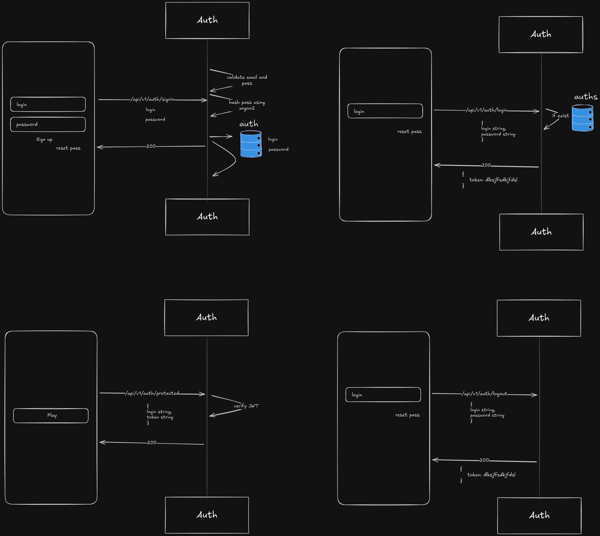

# Auth Server

This is a simple authentication server that uses JWT to authenticate users.

## Auth Server

openssl rand -hex 32

### Endpoints

- POST /signup
- POST /login
- POST /logout
- POST /protected