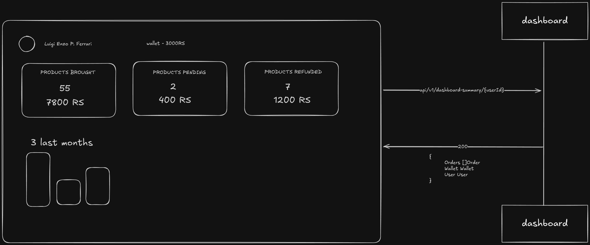

# SERVERS

## Overview

This repository contains some architecture patterns for servers.

## OTP

## BFF (Backend For Frontend)

### Client call for BFF

### BFF call for services

### Authentication

